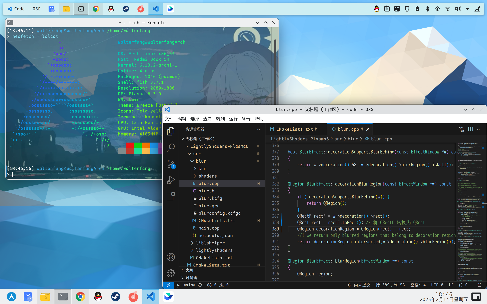

[English](README.md) | 中文

# LightlyShaders v3.0

 此效果与已有的 Plasma 特效一起正常工作。支持 KDE Plasma 版本 >= 6.7。

 

# 依赖关系：

 Plasma版本>=6.7。 

 您将需要qt6、kf6和kwin开发包。 

 **Arch** 下的依赖安装： 
 
 `sudo pacman -S git make cmake gcc gettext extra-cmake-modules qt5-tools qt5-x11extras kcrash kglobalaccel kde-dev-utils kio knotifications kinit kwin`

 **Fedora** 下的依赖安装：

 `sudo dnf install -y cmake gcc-c++ make gettext extra-cmake-modules qt6-qtbase-devel qt6-qtbase-private-devel qt6-qttools-devel kf6-kconfig-devel kf6-kconfigwidgets-devel kf6-kcoreaddons-devel kf6-kcrash-devel kf6-kglobalaccel-devel kf6-ki18n-devel kf6-kio-devel kf6-kservice-devel kf6-knotifications-devel kf6-kwidgetsaddons-devel kf6-kwindowsystem-devel kf6-kguiaddons-devel kf6-kcmutils-devel libepoxy-devel libdrm-devel kwin-devel kdecoration-devel`

# 手动安装

```bash
git clone https://github.com/glassywater/LightlyShaders-Plasma6-Fedora && cd LightlyShaders-Plasma6-Fedora
mkdir qt6build && cd qt6build
cmake ../ -DCMAKE_INSTALL_PREFIX=/usr && make && sudo make install
```

**注： 在Plasma进行了一些更新后，可能需要重新编译此插件，以便处理引入KWin的更改。**
